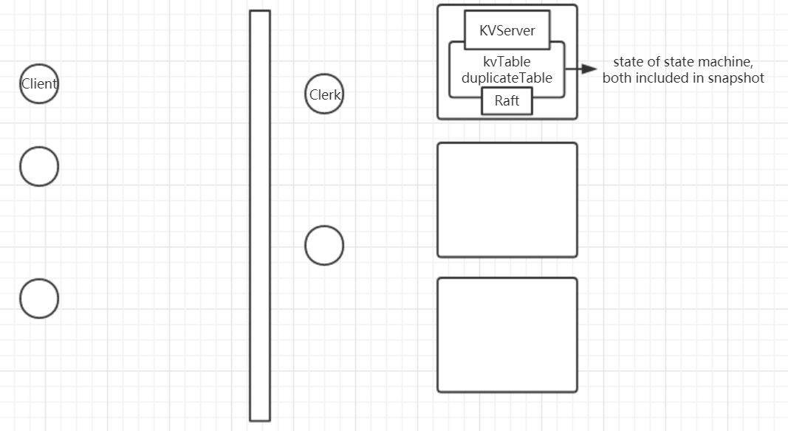

1. 

2. [lab3 hint](https://pdos.csail.mit.edu/6.824/notes/l-spinnaker.txt)

3. 
  > The service supports three operations: Put(key, value), Append(key, arg), and Get(key). Each client talks to the service through a Clerk with Put/Append/Get methods. A Clerk manages RPC interactions with the servers.

4. 
  > Your service must provide strong consistency to applications calls to the Clerk Get/Put/Append methods. Here's what we mean by strong consistency. If called one at a time, the Get/Put/Append methods should act as if the system had only one copy of its state, and each call should observe the modifications to the state implied by the preceding sequence of calls. **For concurrent calls, the return values and final state must be the same as if the operations had executed one at a time in some order**. Calls are concurrent if they overlap in time, for example if client X calls Clerk.Put(), then client Y calls Clerk.Append(), and then client X's call returns. Furthermore, a call must observe the effects of all calls that have completed before the call starts (so we are technically asking for [**linearizability**](https://www.anishathalye.com/2017/06/04/testing-distributed-systems-for-linearizability/)).

5. 
  > **Hint**: After calling Start(), your kvservers will need to wait for Raft to complete agreement.
  >
  > **Hint**: **Your solution needs to handle the case in which a leader has called Start() for a Clerk's RPC, but loses its leadership before the request is committed to the log. In this case you should arrange for the Clerk to re-send the request to other servers until it finds the new leader. One way to do this is for the server to detect that it has lost leadership, by noticing that a different request has appeared at the index returned by Start(), or that Raft's term has changed**. If the ex-leader is partitioned by itself, it won't know about new leaders; but any client in the same partition won't be able to talk to a new leader either, so it's OK in this case for the server and client to wait indefinitely until the partition heals.

  [guide](https://thesquareplanet.com/blog/students-guide-to-raft/#applying-client-operations)：
  > how do you know when a client operation has completed? In the case of no failures, this is simple – you just wait for the thing you put into the log to come back out (i.e., be passed to apply()). When that happens, you return the result to the client. **However, what happens if there are failures? For example, you may have been the leader when the client initially contacted you, but someone else has since been elected, and the client request you put in the log has been discarded. Clearly you need to have the client try again, but how do you know when to tell them about the error?**
  > 
  > **One simple way to solve this problem is to record where in the Raft log the client’s operation appears when you insert it. Once the operation at that index is sent to apply(), you can tell whether or not the client’s operation succeeded based on whether the operation that came up for that index is in fact the one you put there. If it isn’t, a failure has happened and an error can be returned to the client.**

6. [duplicate-detection](https://thesquareplanet.com/blog/students-guide-to-raft/#duplicate-detection)：
  > As soon as you have clients retry operations in the face of errors, you need some kind of **duplicate detection scheme – if a client sends an APPEND to your server, doesn’t hear back, and re-sends it to the next server, your apply() function needs to ensure that the APPEND isn’t executed twice**. To do so, you need some kind of unique identifier for each client request, so that you can recognize if you have seen, and more importantly, applied, a particular operation in the past. **Furthermore, this state needs to be a part of your state machine so that all your Raft servers eliminate the same duplicates**.
  >
  > There are many ways of assigning such identifiers. **One simple and fairly efficient one is to give each client a unique identifier, and then have them tag each request with a monotonically increasing sequence number. If a client re-sends a request, it re-uses the same sequence number. Your server keeps track of the latest sequence number it has seen for each client, and simply ignores any operation that it has already seen**.

  其中的：
  > **Furthermore, this state needs to be a part of your state machine so that all your Raft servers eliminate the same duplicates**.

  是比较重要的点，结合下面的Hint：
  > **Hint**: Your kvserver must be able to detect duplicated operations in the log across checkpoints/crash, **so any state you are using to detect them must be included in the snapshots**. 

  考虑这样一种情况，clerk1请求`PUT 8:x 8 5 y`，Raft复制到majority后，commit，KVServer应用到状态机，但在响应给clerk1前crash了，之后恢复，clerk1重复同一个请求，如果快照中没有包含对clerk1已执行过的请求的记录，那么恢复后的KVServer就会再将该重复的Op复制到majority后commit后再次执行，违背了linearizability。所以snapshot中要包含用于检测重复请求的内容，避免重复执行同样的Op。

7. 什么时候leader才会发送InstallSnapshot RPC给follower？当

   > follower's log ends before leader's log starts.

   这意味着，leader所处的状态机的状态比该follower更新，`rf.lastIncludedIndex`和`rf.lastIncludedTerm`等也比该follower更新。

8. 被包含到snapshot中的LogEntry（即被rf.logs丢弃的LogEntry）必然是已commit和apply的。所以一个规则是，任何时候，

   ```go
   if rf.commitIndex < rf.lastIncludedIndex {
   	rf.commitIndex = rf.lastIncludedIndex
   	rf.lastApplied = rf.lastIncludedIndex
   } else if rf.lastApplied < rf.lastIncludedIndex {
   	rf.lastApplied = rf.lastIncludedIndex
   }
   ```

   避免重复commit和重复apply。

   一般来说，需要执行上述代码的地方有两个：

   1. 在Raft.Make()中，当Raft crash后恢复时，会读取之前持久化的`rf.lastIncludedIndex`。
   2. follower收到leader的InstallSnapshot RPC。

   